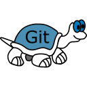
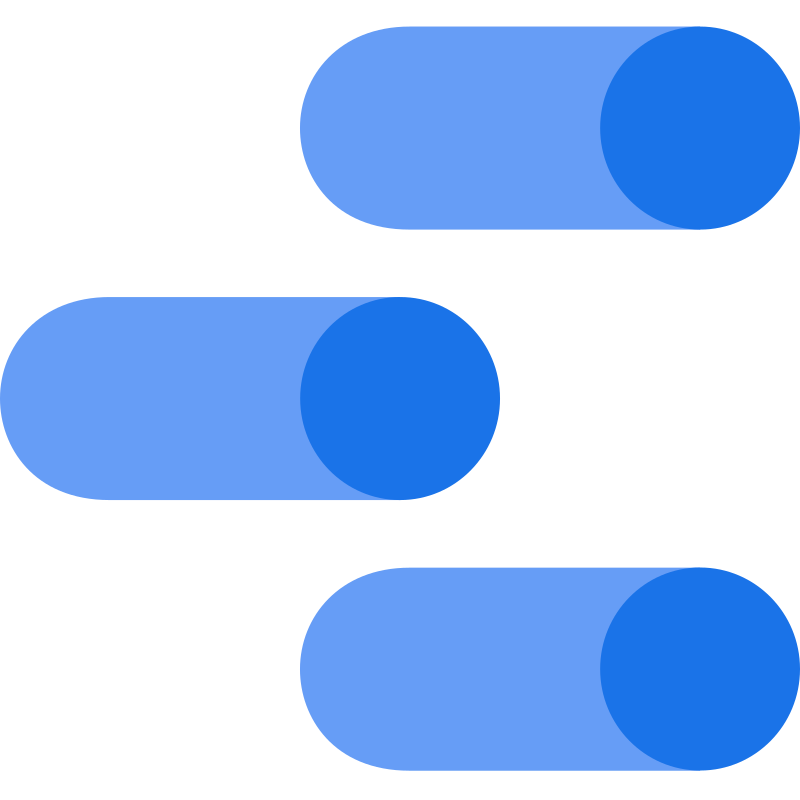

# Renê Santos
 

Engenheiro de Dados Sr. 
Apaixonado pela cultura guiada por dados, tornando grandes desafios em resultados. 

Me encontre também no    e no  .
 
 

____________________________________________________________________________________________________
## Sumário
 

  - [Sumário](#sumario)
  - [Um pouco mais sobre mim](#um_pouco_mais_sobre_mim)
  - [Stack em Dados](#Stack_em_Dados)
    - [linguagens](#linguagens)
    - [versionamento e ci/cd](#versionamento_e_ci/cd)
    - [provedores cloud](#provedores_cloud)
    - [armazenamento](#armazenamento)
    - [processamento](#processamento)
    - [orquestração](#orquestração)
    - [...](#...)
  - [Trajetória Profissional](#Trajetória_Profissional)
  - [Empresas e Clientes para as quais já trabalhei com dados](#Empresas_e_Clientes_para_as_quais_já_trabalhei_com_dados)
    - [setor industrial](#investimentos_coleta_sinacor_corrwin)
    - [setor hospitalar](#investimentos_coleta_historica_corrwin_tbomovclh)
    - [setor educacional]
    - [setor comercio eletrônico]
    - [setor financeiro]
  - [Links Úteis](#links-uteis)
  - [Powered_by_Renê_Santos](#Powered_by_Renê_Santos)
      - [contato](#contato)

 
 

____________________________________________________________________________________________________
## um_pouco_mais_sobre_mim
 

Engenheiro de Dados no setor de consultoria. Especialista em relatórios digitais interativos(dashboards), sendo eles estáticos ou automatizados, assim também como OPRs (One Page Report), se na atuação de análise. Essa função é essencial para uma tomada de decisão mais eficiente dentro dos negócios. Como engenheiro, posso trazer tecnologias de ponta, para que a análise se torne mais poderosa, com automações em batch ou real-time, com o custo mais ajustado para sua necessidade e o maior impacto nos seus resultados.

São 15 anos de experiência nas áreas de engenharia industrial, gestão de empresas, e dados. E, enumerando abaixo soluções de dados que já trabalhei até o momento, garanto que o resultado do seu negócio nunca mais será o mesmo.

I’ve developed a reputation as a trusted technical reference within the company that I’ve worked for, sharing specialized experience with international data teams. I’ve been actively involved in the development of data applications from scratch, as well as in maintaining critical data pipelines. My role encompasses the entire data processing cycle, from initial ingestion to the consumption or semantic layer, complemented by robust data storage strategies.

My approach to data engineering is characterized by creativity in solving business problems and technology agnosticism. I always seek to incorporate different perspectives into problem analysis, ensuring that data engineering projects are meaningfully contextualized within the work methodology lifecycle, addressing issues such as security, data management, and data operations.

Recently, I’ve focused my efforts on platforms such as AWS as a cloud provider, Apache Airflow for orchestration, Apache Spark for processing, and Parquet (Delta Lake) for storage. Python and SQL are my primary tools, and I’ve also explored cutting-edge technologies like Kubernetes and Terraform. Additionally, I have experienced with SQL Server, PostgreSQL, MySQL, and Oracle DB.

I truly believe in the importance of adopting to fundamental data principles and ensuring excellence at every stage of the data handling process, from initial collection to loading in batches or near real-time. This is the way I consider ideal for working with data.

I am confident that I can contribute to the growth of the data department and foster a data-driven culture within the company, leveraging both my technical expertise and experience. Among the skills I bring to the table are: (a) the ability to plan and maintain data pipelines, ensuring that requirements and objectives are well-documented; (b) expertise in change management, enabling successful migrations to meet various business needs; and (c) problem-solving skills combined with a strong sense of urgency and agility in delivering continuous results. This combination of capabilities allows me to drive impactful outcomes.

For more information about my work, I invite you to explore my portfolio [http://portfolio-rene.s3-website-us-east-1.amazonaws.com/]. Let’s connect and discuss how I can contribute to your team.

 
 

|____________________________________________________________________________________________________ [Top](#sumário) |
| ---: |

____________________________________________________________________________________________________
## Stack_em_Dados
 

### linguagens: 
 _  _  _  _  _ 

### versionamento_e_ci/cd: 
 _  _  _  _  _ 

### provedores_cloud: 
 _ 

### ferramentas_de_desenvolvimento: 
 _  _  _ 

### armazenamento: 
 _  _  _  _  _  _  _  _  _  _  _  _  _ 

### processamento: 

### orquestração: 

### iac_e_ambientes: 
 _  _  _  _  _ 

### data_viz: 
 _  _  _  _ 

 
 

|____________________________________________________________________________________________________ [Top](#sumário) |
| ---: |

____________________________________________________________________________________________________
## Trajetória_Profissional
 

* `Carreira Industrial` - (...)
* `Carreira em Dados` - (...)

 
 

|____________________________________________________________________________________________________ [Top](#sumário) |
| ---: |

____________________________________________________________________________________________________
## Empresas_para_as_quais_já_trabalhei
 

...

 
 

|____________________________________________________________________________________________________ [Top](#sumário) |
| ---: |

____________________________________________________________________________________________________
## Clientes_os_quais_já_atendi
 

    mkdocs.yml    # The configuration file.
    docs/
        index.md  # The documentation homepage.
        ...       # Other markdown pages, images and other files.

 
 

|____________________________________________________________________________________________________ [Top](#sumário) |
| ---: |

____________________________________________________________________________________________________
## Powered_by_Renê_Santos
 

### contato:
Entre em contato comigo também via 
    [e-mail](renesantos.pro@gmail.com), 
    [LinkedIn](https://www.linkedin.com/in/renesantospro/) e/ou 
    [GitHub](https://github.com/renesantospro/).

 
 

|____________________________________________________________________________________________________ [Top](#sumário) |
| ---: |

____________________________________________________________________________________________________

____________________________________________________________________________________________________

____________________________________________________________________________________________________

Sobre mim

Soluções

    Ferramentas para Análise de Dados: Microsoft Power BI, Tableau e Google Data Studio. (3 dos 4 maiores players, de acordo com o Quadrante Gartner), bancos de dados mais comuns de mercado como Oracle, PostgreSQL e MySQL;

    Tecnologias de Engenharia de Dados: Modelagem Dimensional (Star ou Snow-Flake Schema), Orquestração de Pipelines via Crontab, Pentaho, Apache Airflow, processamento via Python, SQL, Apache Spark, serviços Cloud com Amazon - AWS (maior player mundial na categoria), consolidadores de dados, como o Dremio e o Athena, e ainda Delta Lake para otimização de armazenamento e operações com dados.

    Infraestrutura física ou Cloud com Buckets AWS-S3 para armazenamento, máquinas virtuais EC2 e/ou cluster de processamento AWS-EKS (Kubernetes), tudo isso suportado por IaC (infraestrutura como código) via Terraform.

    Workflow de desenvolvimento de projetos (CI/CD - Continuos improvement e Continuous development): GitHub e GitLab.

    Para registro, documentação e transferência de conhecimento: MkDocs (ferramenta esta que te possibilita ler minha apresentação no momento).

Vale muito a pena ressaltar que ainda posso desenvolver tudo isso de acordo com metodologias ágeis como Kanban e Scrum.

Mais sobre meu trabalho e certificações no meu perfil no LinkedIn ou também no meu repositório no GitHub. 

Data Ops na prática

Análise de Dados

Através de diferentes tipos de análises dos dados e de muita experiência com gestão, é possível identificar o que o cliente pode fazer para ter suas dores sanadas. Contando com ferramentas de mercado,

analisys_tools

a exploração profunda dos dados e o entendimento do negócio geram insights para uma tomada de decisão significativamente mais assertiva. Abaixo, exemplos da minha atuação:

    Análise de Viralização:

Esse dashboard foi desenvolvido para estudo da dinâmica de um evento em redes sociais (fenômeno de viralização).

viralizacao

    Análise Socioeconômica:

Certa vez, uma empresa necessitava ofertar uma capacitação específica para seus funcionários e, a partir de uma contratação B2B, foi levantado um perfil socioeconômico dos alunos.

socioeconomico

    Monitor de Faturamento (near real-time):

Nesse caso, o acompanhamento de vendas de um e-commerce próximo de fato do real-time foi uma solução que contribuiu muito com a tomada de decisões da diretoria de operações da empresa.

faturamento

Visite também a análise do meu perfil no LinkedIn através de dados.

Engenharia de Dados

A Engenharia, por sua vez, difere-se nas suas características em relação ao processo de análise. Nela, trabalha-se mais por dentro dos dados, em termos computacionais, e ponderando muita performance, aspectos técnicos do dado, da pipeline, do processamento e da infraestrutura, o que permite que esses dados possam ser armazenados e disponibilizados. Como demonstrado na figura abaixo, existe um grande trabalho de padronização de atividades e procedimentos que compõem o dia a dia de um engenheiro de dados.

fluxo_macro

engineering_process

Para tanto, um engenheiro de dados tem a seu favor tecnologias como as elencadas a seguir para que todo o trabalho se torne mais eficiente bem como escalável, rumo a direções como o Big Data, se necessário. Nesta figura, estão reunidas as tecnologias, ferramentas e serviços que mais tenho contato na atividade que executo hoje e aproveito para ressaltar que são todas líderes de mercado, cada uma em sua aplicação.

engineering_tools

Por fim, porém não menos importante, todo o desenvolvimento do trabalho de engenharia se resume em uma arquitetura que organiza tudo de uma forma coerente e funcional, como a figura abaixo nos mostra.

arquitetura

